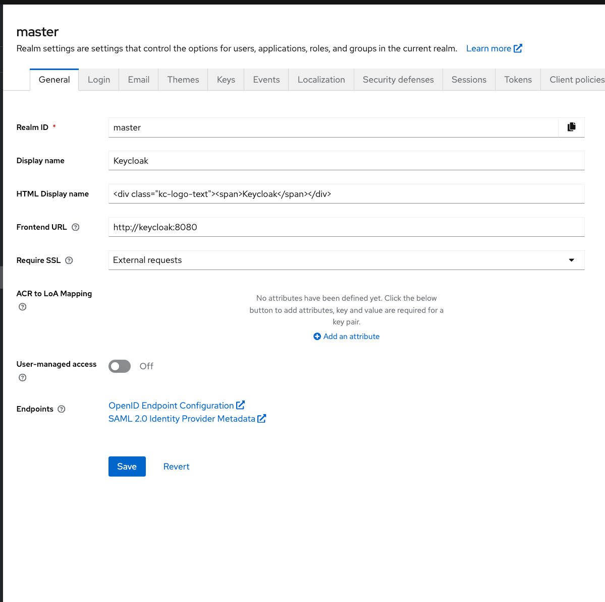
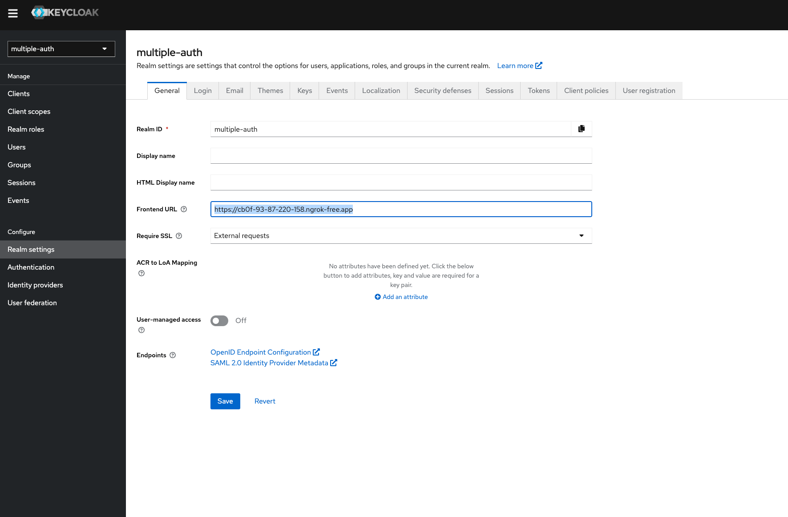

<<<<<<< HEAD
<<<<<<< HEAD
# SingleAuth

Starter project to allow multiple Authentication sources to use a single Authorization

A Spring Boot application that allows a user to login via different providers and maps that login to a single authorization stored in an application specific Keycloak server.

## Technology stack
- Spring Boot 3.2.2+
- Keycloak 23.06+
- UI - Thymeleaf
- Authentication providers
    - GitHub OAtuh
    - Facebook OAuth
    - Google OAuth
    - Username / password via application specific Keycloak server
- Authorization
    - Users mapped to either role User (default) or role Admin

## Functionality
- Register new user with preferred authentication provider.  Note: Creates new user in application specific Keycloak server
- Add authentication provider to existing user.
- Sign-in existing user via any of the configured authentication providers for that user
- Access secured web page for role User based on authorization roles retrieved from local Keycloak server
- Access secured web page for role Admin based on authorization roles retrieved from local Keycloak server

=======
# Spring Boot Employee Management Application
=======
>>>>>>> 5507a74 (Additions to store users got from Keycloak)

Running the project is done via `make` commands

- make run - rebuilds the project and creates a docker image and starts up the keycloak instance
- make up - just starts the services
- make down - puts down services

---

For local development, but since we'll use social login this won't be needed.

Change /etc/hosts entry to point to keycloak docker container:

```/ets/hosts
127.0.0.1       keycloak
```


---


In order to support social login we need to use [ngrok](https://ngrok.com/) and port-forward to 8080.

```ngrok http 8080```

Also the URL got from ngrok needs to be added under realm frontend URL :

<<<<<<< HEAD
### Azure AD Configuration

1. Set up Azure AD as an identity provider.
2. Configure the Azure AD application and permissions.
3. Assign roles (e.g., "admin", "user") to Azure AD groups for authorization.

## Prerequisites

- Java JDK 8 or higher
- Maven

## Build and Run

1. Clone the repository.
2. Navigate to the project directory.
3. Run the following command to build the application:
>>>>>>> 53fd613 (Initial commit)
=======

>>>>>>> 5507a74 (Additions to store users got from Keycloak)
