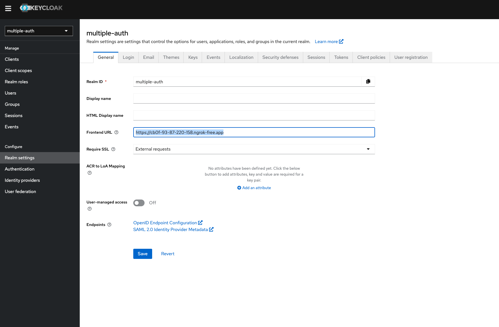
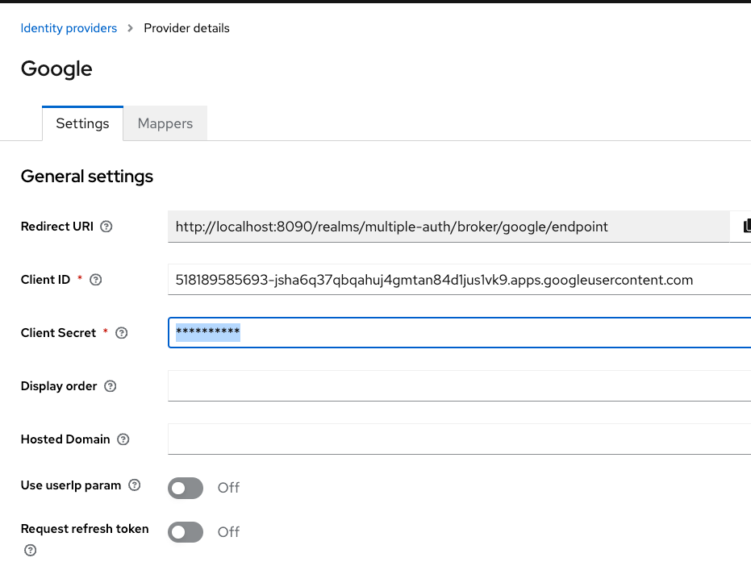

# SingleAuth

Starter project to allow multiple Authentication sources to use a single Authorization

A Spring Boot application that allows a user to login via different providers and maps that login to a single authorization stored in an application specific Keycloak server.

## Technology stack
- Spring Boot 3.2.2+
- Keycloak 23.06+
- UI - Thymeleaf
- Authentication providers
    - GitHub OAtuh
    - Facebook OAuth
    - Google OAuth
    - Username / password via application specific Keycloak server
- Authorization
    - Users mapped to either role User (default) or role Admin

## Functionality
- Register new user with preferred authentication provider.  Note: Creates new user in application specific Keycloak server
- Add authentication provider to existing user.
- Sign-in existing user via any of the configured authentication providers for that user
- Access secured web page for role User based on authorization roles retrieved from local Keycloak server
- Access secured web page for role Admin based on authorization roles retrieved from local Keycloak server


Running the project is done via `make` commands

- make run - rebuilds the project and creates a docker image and starts up the keycloak instance
- make up - just starts the services
- make down - puts down services

---

To access Keycloak admin use localhost:8090 as with ngrok's domain you won't be able to access admin console.

http://localhost:8090/admin/master/console/#/master

---


In order to support social login we need to use [ngrok](https://ngrok.com/) and port-forward to 8080.

```ngrok http 8080```

Also the URL got from ngrok needs to be added under realm frontend URL :


---

Note around realm.json that's getting imported in Keycloak; the secrets are masked so client secrets need to be regenerated 
where needed.

Example: secret for Google identity provider is exported as ****** so needs to be fixed.
